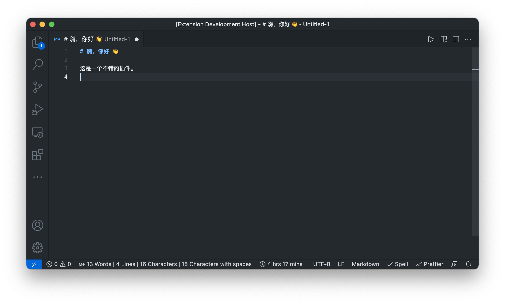
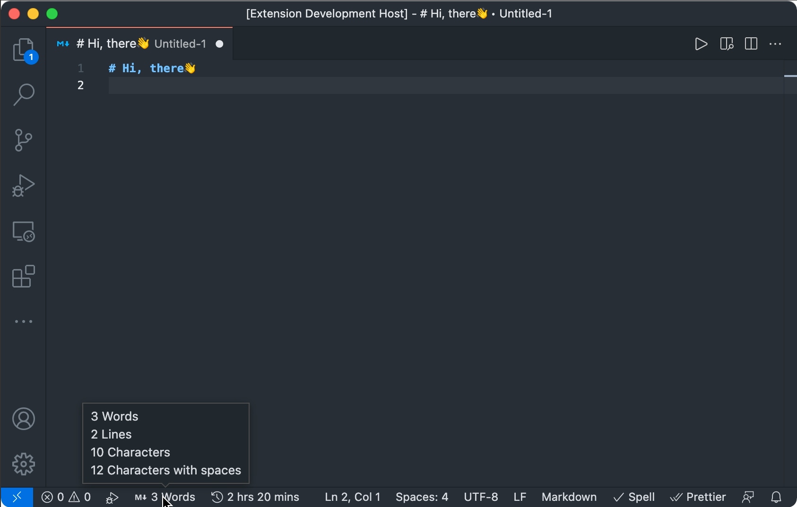
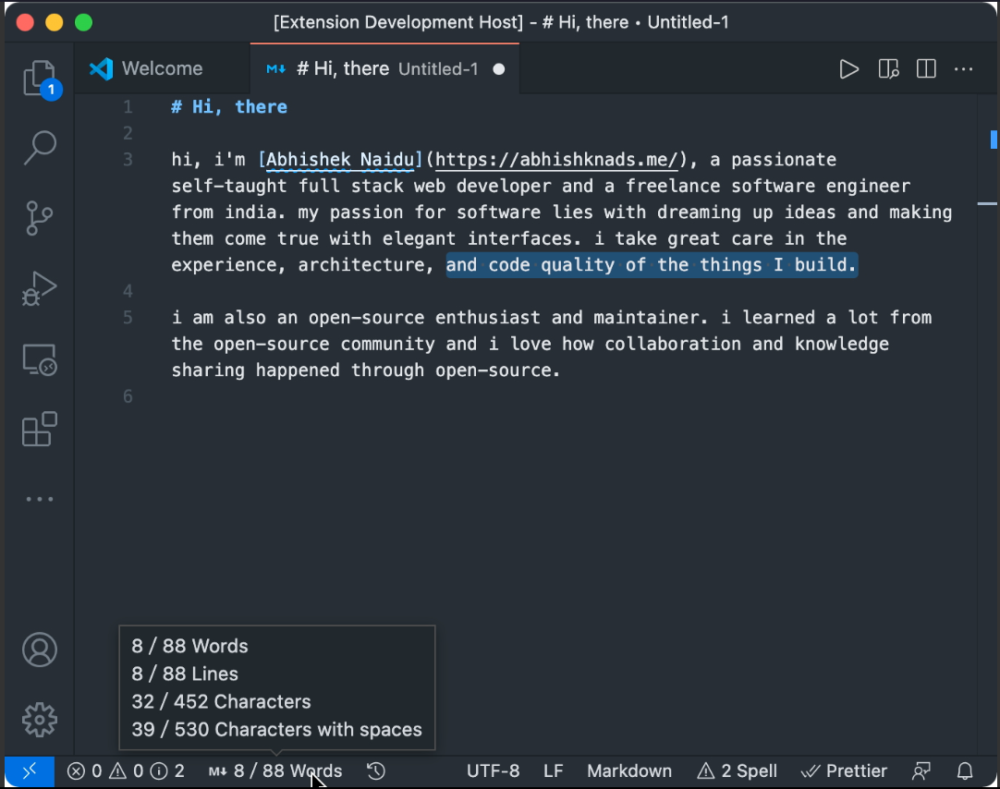

# Markdown 字数统计

[English](./README.md) ∙ [日本語](./README.ja.md) ∙ [한국어](./README.ko.md)

这是一个简单但功能强大的扩展，用于统计 Markdown 和纯文本文件中的字数。它可以在底部状态栏显示字数统计。除了支持使用空格分隔单词的语言外，还支持不使用空格的语言，如CJK字符（中文、韩文、日文）和 Emoji。

## 特点

- 多语言支持
- 统计字数、行数、字符数和包括空格的字符数
- 选中文本计数

### 多语言支持

当前支持识别：

- 使用空格分隔单词的语言（例如英语）
- CJK字符，例如中文、日文、韩文
- Emoji



### 多重统计

当前支持统计字数、行数、字符数和包括空格的字符数。

默认情况下，字数统计显示在状态栏中。当您将鼠标悬停在状态栏项目上时，所有统计信息都显示在工具提示中。



您可以通过配置 [markdown-word-count.statusBarCounts](#settings) 来自定义状态栏内容。

### 选择文本计数

支持计算所选文本的字数。



您可以通过配置 [markdown-word-count.selectionCount](#settings) 来禁用它。

## 设置

以下是设置：

- `markdown-word-count.statusBarCounts`：自定义状态栏中显示的内容。
- `markdown-word-count.selectionCount`：启用/禁用选择计数功能。

```json
  // 默认 settings.json
  "markdown-word-count.statusBarCounts": {
      "words": true,
      "lines": false,
      "characters": false,
      "charactersWithSpaces": false
  },
  "markdown-word-count.selectionCount": false
  ```

## 反馈与支持

如果有任何反馈（使用问题、发现错误、功能请求、语言支持等），欢迎在 GitHub 仓库上提出问题。
